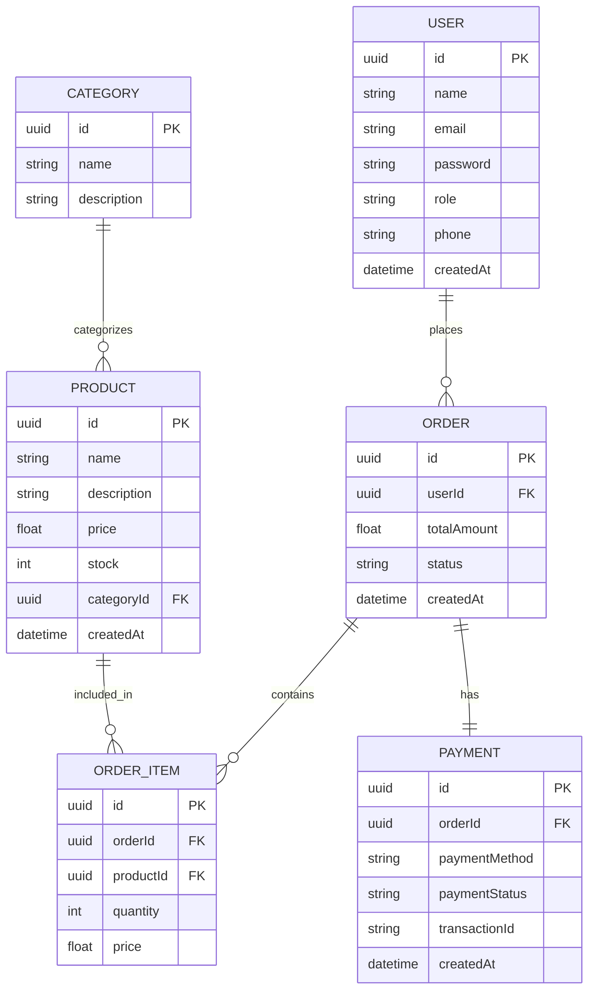

# 🧸 BLOKYZ – Toy Ecommerce Platform

Blokyz is a full-scale modern ecommerce platform for toys built using **Next.js**.  
The platform supports **user authentication, product browsing, secure checkout, multiple payment options (including crypto), order tracking, and a powerful admin dashboard**.

This project is designed to be **scalable, secure, and production-ready**, suitable for real-world business use.

---

## 🚀 Project Overview

**Blokyz** allows customers to:
- Create an account and log in securely
- Browse, search, and purchase toys
- Pay using traditional payment gateways or cryptocurrency
- Track, cancel, and manage their orders
- View and update personal information

Admins can:
- Manage products, categories, and inventory
- Handle orders and users
- Verify payments
- Perform full CRUD operations
- Monitor platform analytics

---

## ✨ Features

### 👤 Customer Features
- User Signup & Login
- Browse Products
- Product Search & Filtering
- Add to Cart
- Secure Checkout
- Multiple Payment Options:
  - Credit / Debit Cards
  - UPI & Wallets
  - Cryptocurrency Payments
- Order Tracking
- Order Cancellation
- Profile & Order History Management

---

### 🛠️ Admin Features
- Admin Authentication
- Product Management (CRUD)
- Category Management
- Inventory Management
- Order Management
- User Management
- Payment Verification
- Sales & Analytics Dashboard

---

## 🧱 Tech Stack

| Layer | Technology |
|------|-----------|
| Frontend | Next.js, TypeScript |
| Styling | Tailwind CSS |
| Backend | Next.js API Routes / Node.js |
| Database | PostgreSQL |
| ORM | Prisma |
| Authentication | NextAuth / JWT |
| Payments | Stripe / Razorpay / Crypto Wallet APIs |
| Deployment | Vercel |
| Version Control | Git & GitHub |

---

## 🏗️ System Architecture

- Client–Server Architecture
- RESTful APIs
- Secure Authentication & Authorization
- Role-Based Access Control (RBAC)
- Modular and Scalable Design

---

# 📊 DATA FLOW DIAGRAMS (DFD)

---

## 🔹 DFD Level 0 – Context Diagram

Represents **Blokyz as a single system** interacting with external entities.

### External Entities
- Customer
- Admin
- Payment Gateway
- Crypto Network
- Notification Service

## 🔹 DFD Level 1 – System Decomposition

Breaks the Blokyz system into major functional modules.

### Core Processes
- User Authentication
- Product Management
- Order Management
- Payment Processing
- Profile Management
- Admin Dashboard

## 🔹 DFD Level 2 – Detailed Flow

🧑 Customer Module – DFD Level 2

🛠️ Admin Module – DFD Level 2

💳 Payment Module – DFD Level 2

## 🔐 Security Features
- Encrypted Password Storage
- Token-Based Authentication (JWT)
- Secure API Routes
- Role-Based Access Control
- Secure Payment Handling
- Input Validation & Sanitization

## 📦 Future Enhancements
- AI-based Product Recommendations
- Reviews & Ratings System
- Subscription-Based Toy Boxes
- Multi-Vendor Marketplace

## 👨‍💻 Author
Kartik Dhiman

## 🏁 Conclusion
Blokyz is a complete ecommerce solution designed with modern technologies and best practices.
It demonstrates real-world ecommerce workflows, scalable architecture, and secure payment handling, making it suitable for client demos, interviews, and production deployment.
